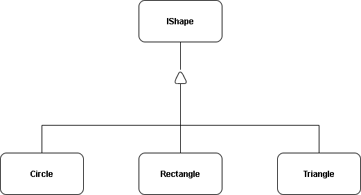

# ShapeAreaCalculator



# Shape Area Calculation — Applying the Open For Extension Principle (SOLID)

## Overview
This project is a demonstration of the **Open for extension and Closed for Modification Principle (OCP)** from the SOLID principles of software design.

- **Open for Extension** → The system can be extended by adding new shapes without changing existing code.  
- **Closed for Modification** → The existing `IShape` interface and shape classes do not need to be modified when new shapes are introduced.

By designing an `IShape` interface and letting each shape class implement its own `Area()` calculation, the code follows Open for Extension.  
For example, to add a `Square` or `Polygon`, you simply create a new class implementing the interface `IShape` — no changes to the `Circle`, `Rectangle`, or `Triangle` classes are needed.

---

## 🛠 How It Works (Following OCP)

1. **Common Abstraction (`IShape`)**  
   ```csharp
   public interface IShape
   {
       double Area();
   }

- All shapes agree to provide their own Area() implementation.

- This keeps the system closed for modification: no existing class needs to change.

2. Concrete Implementations
Each shape implements the interface independently:

- Circle → returns πr²

- Rectangle → returns length × width

- Triangle → returns 0.5 × base × height

```csharp
IShape circle = new Circle(5);
Console.WriteLine(circle.Area()); // Works without knowing the exact class
````
- New shapes can be extended by simply adding new classes implementing IShape.
